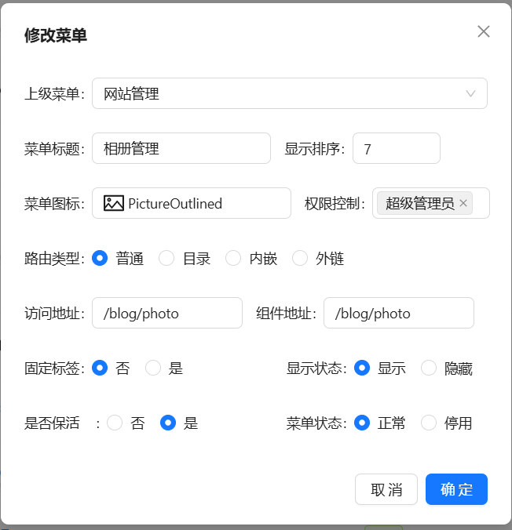
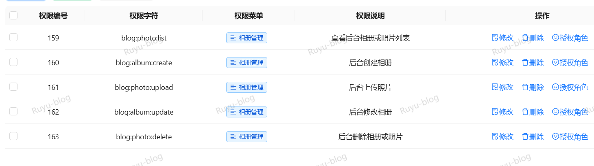
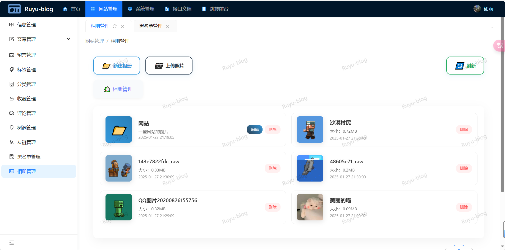

## 升级v1.6.0导入[t_photo.sql](t_photo.sql)表
**1、新建相册管理菜单：**

*2、*需要给超级管理员5个权限：**
> 1. blog:photo:list(后台相册或照片列表)
> 2. blog:album:create(后台创建相册)
> 3. blog:photo:upload(后台上传照片)
> 4. blog:album:update(后台修改相册)
> 5. blog:photo:delete(后台删除相册或照片)
> 

### 注意：v1.5.0属于完整数据库，v1.6.0属于升级内容，需要先导入v1.5.0的数据库然后在升级v1.6.0
 
## 最后：
**现在是2025年1月27日明天就是除夕，提前祝大家新年快乐，
这会是今年的最后一次版本更新，各种问题原因这次更新拖了很久，
很抱歉，明年也许还会继续维护，谢谢大家的喜欢这个乱七八糟的项目，很高兴能与大家一起进步，
很感谢大家的建议，谢谢！！！**